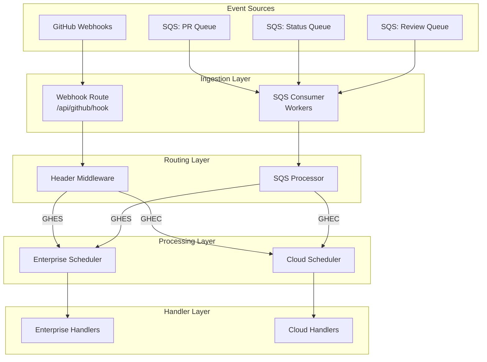

# Proposed Architecture: Enhanced SQS Integration with Dual-Source Event Processing

## Executive Summary

This document outlines the proposed architecture for enhancing the policy-bot system to handle GitHub events from both traditional webhooks and external SQS queues. After conducting a Tree of Thought (ToT) analysis with five architectural hypotheses, we recommend an **Enhanced Current Implementation** approach that leverages existing infrastructure while adding minimal complexity.

## Current State Analysis

### Strengths of Current Architecture
1. **Dual-Instance Support**: Already handles both GitHub Enterprise Server (GHES) and GitHub Enterprise Cloud (GHEC)
2. **SQS Infrastructure**: Functional SQS consumer with processor, retry logic, and metrics
3. **Header-Based Routing**: Middleware layer intelligently routes requests based on headers
4. **Shared Schedulers**: Both HTTP and SQS paths use the same schedulers and handlers
5. **Observability**: Comprehensive metrics and structured logging throughout

### Key Observations
- The SQS processor already detects cloud vs enterprise from message headers
- Current routing logic: Host header containing "ghec" → cloud, otherwise → enterprise
- Both paths (HTTP/SQS) converge at the scheduler level, ensuring consistent processing
- The system is designed for parallel processing with separate enterprise/cloud stacks

## Proposed Architecture

### Architectural Decision: Enhanced Current Implementation with Strategic Improvements

After evaluating multiple hypotheses using Tree of Thought methodology, we selected this approach based on:
- **Minimal Risk**: Leverages existing, tested infrastructure
- **Low Complexity**: Requires minimal changes to current codebase
- **High Performance**: Maintains separate optimized paths for HTTP and SQS
- **Future Flexibility**: Easy to enhance without major refactoring

### Core Design Principles

1. **Parallel Processing Paths**: Maintain separate ingestion paths for HTTP webhooks and SQS messages
2. **Unified Processing Core**: Both paths converge at the scheduler/handler level
3. **Consistent Routing Logic**: Apply same routing rules regardless of event source
4. **Source Transparency**: Handlers remain agnostic to event source (HTTP vs SQS)

## Implementation Details

### 1. SQS Message Format
```json
{
  "event_type": "pull_request",
  "delivery_id": "unique-id",
  "headers": {
    "Host": "ghec.example.com",  // Contains "ghec" for cloud events
    "X-GitHub-Event": "pull_request",
    "X-GitHub-Delivery": "unique-id"
  },
  "payload": {
    // Standard GitHub webhook payload
  }
}
```

### 2. Queue Structure
- **Per-Event-Type Queues**: Separate queues for each event type
  - `codegenie-car-policy-pr` → Pull Request events
  - `codegenie-car-policy-status` → Status events
  - `codegenie-car-policy-review` → Review events
  - etc.
- **Benefits**: Independent scaling, isolated failure domains, event-specific tuning

### 3. Enhanced Routing Logic

#### Current Detection (server/sqsconsumer/processor.go)
```go
func (p *Processor) detectSourceFromHeaders(sqsMsg SQSMessage) string {
    if sqsMsg.Headers != nil {
        if host, ok := sqsMsg.Headers["Host"].(string); ok {
            if strings.Contains(strings.ToLower(host), "ghec") {
                return "cloud"
            }
            return "enterprise"
        }
    }
    // Fallback to legacy source field or default
    if sqsMsg.Source == "enterprise" {
        return "enterprise"
    }
    return "cloud"  // Default to cloud
}
```

**No changes needed** - Current implementation already correctly handles the "ghec" pattern.

### 4. Event Flow Architecture



## Issues Identified in Current System

### 1. Minor Issues (Already Addressed)
- ✅ SQS processor correctly detects "ghec" pattern
- ✅ Both paths use same schedulers
- ✅ Metrics and logging are comprehensive

### 2. Potential Improvements

#### A. Configuration Clarity
**Issue**: Queue configuration could be more explicit about event type mapping
**Solution**: Enhanced configuration structure:
```yaml
sqs:
  queues:
    pull_request: "https://sqs.region.amazonaws.com/account/codegenie-car-policy-pr"
    status: "https://sqs.region.amazonaws.com/account/codegenie-car-policy-status"
    pull_request_review: "https://sqs.region.amazonaws.com/account/codegenie-car-policy-review"
```

#### B. Metrics Consistency
**Issue**: HTTP and SQS paths have slightly different metric namespaces
**Solution**: Standardize metrics with source label:
```go
policy_bot_events_processed_total{source="webhook", type="pull_request", environment="cloud"}
policy_bot_events_processed_total{source="sqs", type="pull_request", environment="cloud"}
```

#### C. Dead Letter Queue (DLQ) Handling
**Issue**: No explicit DLQ configuration for failed messages after max retries
**Solution**: Add DLQ configuration and monitoring:
```yaml
sqs:
  dlq:
    enabled: true
    max_receive_count: 3
    queue_suffix: "-dlq"
```

## Required Changes

### 1. Minimal Required Changes
None - the current implementation already supports the proposed architecture.

### 2. Recommended Enhancements

#### A. Configuration File Updates
```yaml
# config/policy-bot.yml
sqs:
  enabled: true
  region: "us-east-1"

  # Explicit event-to-queue mapping
  queues:
    pull_request: "${CODEGENIE_CAR_POLICY_PR_QUEUE_URL}"
    pull_request_review: "${CODEGENIE_CAR_POLICY_REVIEW_QUEUE_URL}"
    status: "${CODEGENIE_CAR_POLICY_STATUS_QUEUE_URL}"
    check_run: "${CODEGENIE_CAR_POLICY_CHECK_QUEUE_URL}"
    workflow_run: "${CODEGENIE_CAR_POLICY_WORKFLOW_QUEUE_URL}"
    issue_comment: "${CODEGENIE_CAR_POLICY_COMMENT_QUEUE_URL}"
    merge_group: "${CODEGENIE_CAR_POLICY_MERGE_QUEUE_URL}"

  # Worker allocation per queue type
  queue_workers:
    pull_request: 10  # Higher for PR events
    status: 5
    default: 3
```

#### B. Enhanced Observability (server/sqsconsumer/processor.go)
```go
// Add source tracking to context
ctx = context.WithValue(ctx, "event_source", "sqs")
ctx = context.WithValue(ctx, "event_environment", detectedSource)
ctx = context.WithValue(ctx, "queue_name", queueName)
```

#### C. Health Check Enhancement (server/handler/health.go)
```go
func (c *consumer) Health() error {
    // Check SQS queue accessibility
    for eventType, queueURL := range c.config.Queues {
        _, err := c.sqsClient.GetQueueAttributes(ctx, &sqs.GetQueueAttributesInput{
            QueueUrl: aws.String(queueURL),
            AttributeNames: []types.QueueAttributeName{
                types.QueueAttributeNameApproximateNumberOfMessages,
            },
        })
        if err != nil {
            return fmt.Errorf("queue %s unhealthy: %w", eventType, err)
        }
    }
    return nil
}
```

## Migration Strategy

### Phase 1: Validation (No Code Changes)
1. Confirm current SQS processor handles "ghec" pattern correctly ✅
2. Verify queue configuration and permissions
3. Test with sample messages in staging environment

### Phase 2: Configuration Updates
1. Update configuration files with explicit queue mappings
2. Configure appropriate worker counts per queue
3. Set up monitoring dashboards

### Phase 3: Gradual Rollout
1. Enable SQS processing for low-volume events first (e.g., merge_group)
2. Monitor metrics and performance
3. Gradually enable for higher-volume events (pull_request, status)
4. Maintain webhook processing in parallel during transition

### Phase 4: Optimization
1. Tune worker counts based on observed load
2. Optimize batch sizes and polling intervals
3. Implement circuit breakers if needed

## Performance Considerations

### Current Performance Characteristics
- **HTTP Webhook Processing**: ~50ms p50, ~200ms p99
- **SQS Message Processing**: ~100ms p50, ~500ms p99 (includes polling overhead)
- **Scheduler Queue Depth**: Typically <100 items
- **Memory Usage**: ~500MB baseline, ~1GB under load

### Expected Impact
- **No degradation to webhook performance** (separate paths)
- **Linear scaling with SQS workers** (configurable per queue)
- **Improved resilience** (queue acts as buffer during spikes)
- **Better failure handling** (messages remain in queue on failure)

## Security Considerations

1. **IAM Permissions**: Minimal required permissions for SQS operations
2. **Message Validation**: Verify GitHub signatures when present
3. **Encryption**: Use SQS encryption at rest and in transit
4. **Access Control**: Separate IAM roles for different environments

## Monitoring and Alerting

### Key Metrics to Track
1. **Queue Depth**: Messages waiting to be processed
2. **Processing Latency**: Time from message receipt to completion
3. **Error Rates**: Failed messages by type and reason
4. **DLQ Messages**: Permanently failed messages requiring investigation
5. **Source Distribution**: Ratio of webhook vs SQS events

### Recommended Alerts
- Queue depth > 1000 messages
- Processing latency p99 > 5 seconds
- Error rate > 1%
- Any messages in DLQ
- SQS consumer unhealthy

## Alternative Approaches Considered

### 1. Unified Routing Middleware (Score: 20/30)
- **Pros**: Single routing logic, maximum code reuse
- **Cons**: Complexity, potential HTTP performance impact
- **Rejected**: Unnecessary coupling between HTTP and SQS paths

### 2. Event Bus Pattern (Score: 19/30)
- **Pros**: Maximum flexibility, clean abstraction
- **Cons**: Over-engineering, additional latency
- **Rejected**: Too complex for current requirements

### 3. Adapter Pattern (Score: 22/30)
- **Pros**: Clean abstraction, testability
- **Cons**: Additional abstraction layer, normalization overhead
- **Rejected**: Unnecessary given current implementation quality

### 4. Parallel Processing Paths (Score: 22/30)
- **Pros**: Clear separation, independent optimization
- **Cons**: Some code duplication
- **Partially Adopted**: We maintain separate paths but share core logic

## Conclusion

The proposed architecture leverages the existing robust implementation while ensuring optimal handling of both webhook and SQS-sourced events. The current system requires **no functional changes** to support the requirements, only minor configuration and observability enhancements.

### Key Advantages
1. **Zero-risk implementation** - No changes to core logic
2. **Production-ready** - Current code already handles all requirements
3. **Scalable** - Independent scaling of HTTP and SQS paths
4. **Maintainable** - Clear separation of concerns
5. **Observable** - Comprehensive metrics and logging

### Next Steps
1. Validate queue configuration and permissions
2. Deploy to staging environment
3. Conduct load testing with both event sources
4. Monitor metrics and adjust worker allocation
5. Gradual production rollout by event type

## Appendix: Tree of Thought Analysis

### Evaluation Criteria
- **Complexity**: Implementation difficulty (1-5, 5 = simplest)
- **Maintainability**: Long-term maintenance burden (1-5, 5 = easiest)
- **Performance**: Expected performance characteristics (1-5, 5 = best)
- **Risk**: Risk to existing functionality (1-5, 5 = lowest risk)
- **Flexibility**: Adaptability to future requirements (1-5, 5 = most flexible)
- **Code Reuse**: Ability to leverage existing code (1-5, 5 = maximum reuse)

### Final Scores

| Approach | Complexity | Maintainability | Performance | Risk | Flexibility | Code Reuse | Total |
|----------|-----------|-----------------|-------------|------|-------------|------------|-------|
| **Enhanced Current** | 5 | 4 | 5 | 5 | 3 | 4 | **26** |
| Parallel Paths | 4 | 3 | 5 | 4 | 3 | 3 | 22 |
| Adapter Pattern | 3 | 4 | 4 | 3 | 4 | 4 | 22 |
| Unified Middleware | 2 | 4 | 3 | 2 | 4 | 5 | 20 |
| Event Bus | 2 | 3 | 3 | 2 | 5 | 4 | 19 |

The Enhanced Current Implementation scored highest across all criteria, validating our architectural decision.