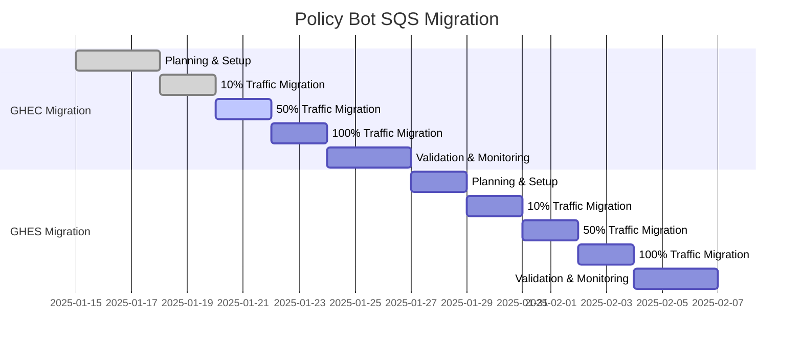
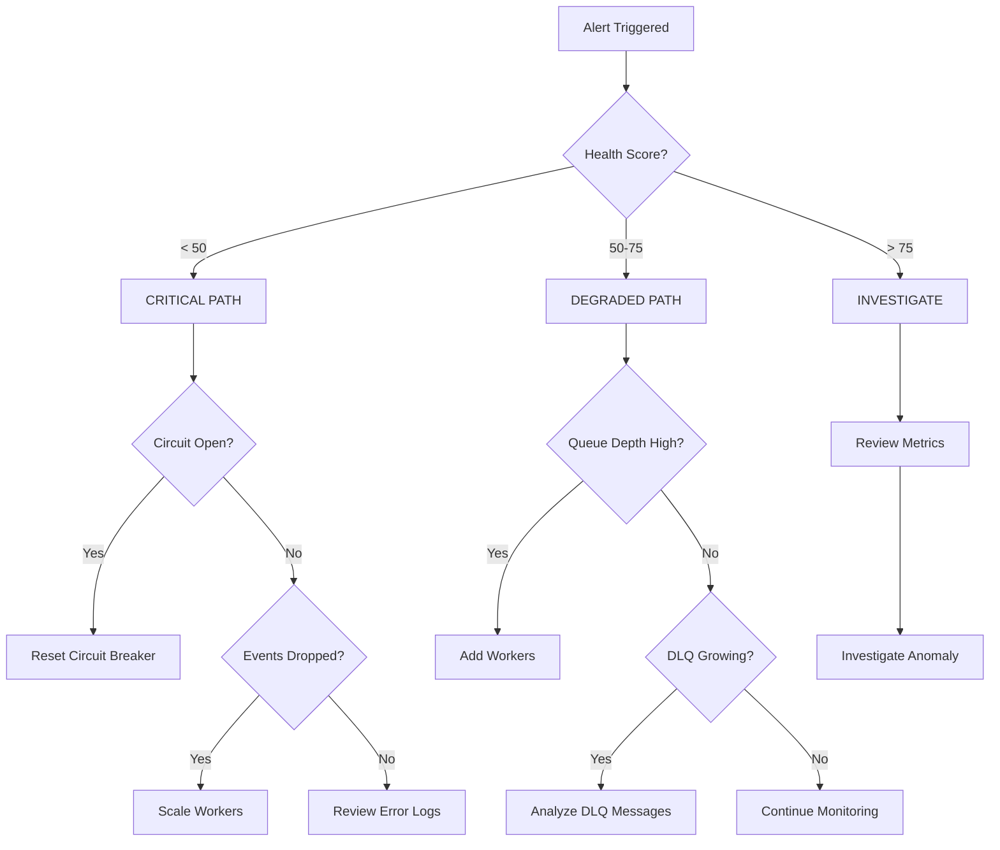

# Operations Playbook: Policy Bot Event-Driven System

**Version**: 1.0.0
**Last Updated**: January 2025
**Audience**: SRE, Operations Teams, On-Call Engineers

---

## Quick Reference

| Alert | Severity | Response Time | Page |
|-------|----------|---------------|------|
| Circuit Breaker Open | 🔴 Critical | < 5 min | [Response](#circuit-breaker-open) |
| Success Rate < 95% | 🔴 Critical | < 5 min | [Response](#low-success-rate) |
| Dropped Events > 0 | 🔴 Critical | < 5 min | [Response](#dropped-events) |
| DLQ Messages > 10 | 🟡 Warning | < 30 min | [Response](#dlq-accumulation) |
| Queue Depth > 100 | 🟡 Warning | < 30 min | [Response](#high-queue-depth) |

**Dashboard**: [New Relic Policy Bot](https://one.newrelic.com/launcher/dashboards)
**Runbooks**: This document
**Escalation**: [Contact Matrix](#escalation-matrix)

---

## 1. ROLLOUT STRATEGY

### 1.1 Migration Timeline



### 1.2 Traffic Migration Process

#### Phase 1A: 10% Traffic (Canary)
```bash
# Enable SQS for 10% of events
aws lambda update-function-configuration \
  --function-name github-webhook-router \
  --environment Variables='{
    "SQS_ROUTING_PERCENTAGE": "10",
    "SQS_ENABLED_REPOS": "repo1,repo2,repo3"
  }'

# Monitor for 24-48 hours
```

**Validation Checklist**:
- [ ] Success rate > 99.5%
- [ ] Zero dropped events
- [ ] P95 latency < 500ms
- [ ] Circuit breaker remains closed
- [ ] No DLQ accumulation

#### Phase 1B: 50% Traffic (Expanded)
```bash
# Increase to 50%
aws lambda update-function-configuration \
  --function-name github-webhook-router \
  --environment Variables='{
    "SQS_ROUTING_PERCENTAGE": "50",
    "SQS_ENABLED_ORGS": "org1,org2"
  }'
```

#### Phase 1C: 100% Traffic (Full Migration)
```bash
# Route all GHEC traffic to SQS
aws lambda update-function-configuration \
  --function-name github-webhook-router \
  --environment Variables='{
    "SQS_ROUTING_PERCENTAGE": "100",
    "WEBHOOK_FALLBACK_ENABLED": "true"
  }'
```

### 1.3 Rollback Procedure

**Immediate Rollback** (< 1 minute):
```bash
# Revert to webhook processing
aws lambda update-function-configuration \
  --function-name github-webhook-router \
  --environment Variables='{
    "SQS_ROUTING_PERCENTAGE": "0",
    "WEBHOOK_ONLY_MODE": "true"
  }'

# Verify rollback
curl -X GET https://policy-bot.company.com/api/health
```

**Gradual Rollback** (controlled):
```bash
# Reduce traffic progressively
for pct in 75 50 25 10 0; do
  aws lambda update-function-configuration \
    --function-name github-webhook-router \
    --environment Variables="{\"SQS_ROUTING_PERCENTAGE\": \"$pct\"}"

  echo "Waiting 5 minutes at $pct%..."
  sleep 300
done
```

### 1.4 Selective Webhook Filtering Configuration (Phase 5)

**Purpose**: Gradually disable high-volume webhook events for GHEC during transition to full event-driven architecture, reducing scheduler queue pressure while maintaining SQS event processing.

**Channel Switches (NEW)**: The new `installation_filter` block controls whether the installation-aware filter wraps HTTP and/or SQS handlers. Default: webhooks disabled, SQS enabled.

```yaml
installation_filter:
  webhook_enabled: false  # Turn on when you want HTTP ingress filtered
  sqs_enabled: true       # Leave enabled to protect the SQS worker pools
```

#### Configuration Management

**Enable Filtering for Status Events (GHEC Only)**:
```yaml
# config/production.yml
sqs:
  enabled: true
  queues:
    status:
      east_region_url: "https://sqs.us-east-1.amazonaws.com/123/status"
      ghec_enabled: false  # ← Disables status webhooks for GHEC
      ghes_enabled: true   # ← GHES webhooks continue to work
```

**Expand Filtering to Additional Events**:
```yaml
sqs:
  enabled: true
  queues:
    status:
      east_region_url: "https://sqs.us-east-1.amazonaws.com/123/status"
      ghec_enabled: false
      ghes_enabled: true

    check_suite:
      east_region_url: "https://sqs.us-east-1.amazonaws.com/123/check-suite"
      ghec_enabled: false  # ← Disable check_suite webhooks for GHEC
      ghes_enabled: true

    check_run:
      east_region_url: "https://sqs.us-east-1.amazonaws.com/123/check-run"
      ghec_enabled: false  # ← Disable check_run webhooks for GHEC
      ghes_enabled: true
```

#### Rollout Process

**Phase A: Status Events Only**
1. Update config to disable status webhooks for GHEC
2. Deploy config change (no code changes needed)
3. Monitor metrics for 24-48 hours:
   ```bash
   # Check skipped webhook metrics
   curl https://policy-bot.company.com/api/metrics | grep webhook.events.skipped

   # Expected output:
   # github.webhook.events.skipped.status.cloud: 1500-2000/hour
   # github.webhook.events.passed.status.enterprise: 50-100/hour
   ```
4. Verify scheduler queue depth reduced by 20-30%

**Phase B: Expand to Check Events**
1. Add check_suite and check_run to filtered events
2. Deploy config change
3. Monitor metrics for 48 hours
4. Verify scheduler queue depth reduced by 40-50%

**Phase C: All High-Volume Events**
1. Identify remaining high-volume events from metrics
2. Add to filtered events list
3. Monitor until only critical webhook events remain

#### Monitoring & Validation

**Key Metrics to Monitor**:
```bash
# Skipped webhook events (should increase)
github.webhook.events.skipped
github.webhook.events.skipped.status.cloud

# Passed webhook events (should decrease for GHEC)
github.webhook.events.passed
github.webhook.events.passed.status.cloud

# SQS processing (should remain stable)
sqs.messages.processed
sqs.processing.latency.p95

# Scheduler queue depth (should decrease)
github.event.queue.depth
```

**Health Checks**:
1. **Webhook Response Time**: Should remain < 50ms for skipped events
2. **SQS Processing**: Should show no change in throughput or latency
3. **GHES Webhooks**: Should continue processing normally
4. **Event Loss**: Should remain at zero

**New Relic Queries**:
```sql
-- Webhook filtering effectiveness
SELECT rate(count(*), 1 minute)
FROM Metric
WHERE metricName LIKE 'github.webhook.events.%'
FACET metricName
TIMESERIES

-- Scheduler queue relief
SELECT average(github.event.queue.depth)
FROM Metric
WHERE appName = 'policy-bot'
TIMESERIES AUTO

-- SQS stability validation
SELECT percentile(sqs.processing.latency, 95, 99)
FROM Metric
TIMESERIES AUTO
```

#### Rollback Procedure

**Immediate Rollback** (restore all webhook processing):
```yaml
# Set all events to enabled for both environments
sqs:
  queues:
    status:
      ghec_enabled: true  # ← Re-enable status webhooks
      ghes_enabled: true

    check_suite:
      ghec_enabled: true  # ← Re-enable check_suite webhooks
      ghes_enabled: true
```

Deploy config and verify within 5 minutes:
```bash
# Verify webhooks are being processed
curl https://policy-bot.company.com/api/metrics | grep webhook.events.passed

# Should show increase in passed events
```

**Partial Rollback** (re-enable specific events):
```yaml
# Re-enable only status events, keep others filtered
sqs:
  queues:
    status:
      ghec_enabled: true  # ← Re-enabled
      ghes_enabled: true

    check_suite:
      ghec_enabled: false # ← Still filtered
      ghes_enabled: true
```

#### Troubleshooting

**Issue**: Webhooks not being filtered despite config changes
```bash
# Check if SQS is enabled in config
grep "sqs:" config/production.yml

# Verify middleware is active
curl https://policy-bot.company.com/api/health | jq '.middleware.event_filter'

# Check logs for filter decisions
kubectl logs -f deployment/policy-bot | grep "webhook event skipped"
```

**Issue**: GHES webhooks accidentally filtered
```bash
# Verify environment detection is working
kubectl logs -f deployment/policy-bot | grep "environment detected"

# Should show "enterprise" for GHES webhooks
# If showing "cloud", check X-GitHub-Enterprise-Host header routing
```

**Issue**: Metrics not recording skipped events
```bash
# Verify metrics registry is configured
curl https://policy-bot.company.com/api/metrics | grep webhook.events

# Check for metric registration errors in logs
kubectl logs deployment/policy-bot | grep "metric registration"
```

#### Best Practices

1. **Gradual Rollout**: Start with one event type, monitor for 48 hours before expanding
2. **Monitor GHES Impact**: Ensure GHES webhooks are never filtered
3. **SQS Validation**: Verify SQS processing remains stable throughout rollout
4. **Preserve Critical Events**: Never filter critical events like pull_request, installation
5. **Metrics First**: Confirm metrics are flowing before relying on them for decisions
6. **Rollback Plan**: Test rollback procedure in staging before production rollout

#### Configuration Examples

**Conservative (Status Only)**:
```yaml
sqs:
  queues:
    status:
      ghec_enabled: false
      ghes_enabled: true
    # All other events implicitly enabled
```

**Aggressive (Multiple Events)**:
```yaml
sqs:
  queues:
    status:
      ghec_enabled: false
      ghes_enabled: true
    check_suite:
      ghec_enabled: false
      ghes_enabled: true
    check_run:
      ghec_enabled: false
      ghes_enabled: true
    workflow_run:
      ghec_enabled: false
      ghes_enabled: true
```

**Full SQS Migration (Disable All Webhooks)**:
```yaml
sqs:
  queues:
    # Only keep critical events as webhooks
    pull_request:
      ghec_enabled: true   # Keep as webhook
      ghes_enabled: true
    installation:
      ghec_enabled: true   # Keep as webhook
      ghes_enabled: true

    # Route everything else through SQS only
    status:
      ghec_enabled: false  # SQS only
      ghes_enabled: true
    check_suite:
      ghec_enabled: false  # SQS only
      ghes_enabled: true
    # ... etc
```

---

## 2. OBSERVABILITY STACK

### 2.1 Dashboard Overview

**[Import Dashboard](../.claude/dashboards/new-relic-dashboard.json)**

| Page | Purpose | Key Metrics |
|------|---------|-------------|
| **System Health** | Overall status | Health score, success rate, throughput |
| **Performance** | Latency analysis | P50/P95/P99, processing time |
| **Capacity** | Resource utilization | Queue depth, workers, cache |
| **Errors** | Failure analysis | Auth failures, circuit breaker, DLQ |
| **Tracing** | Request flow | Distributed traces, bottlenecks |

### 2.2 Key Metrics & SLIs

#### Service Level Indicators (SLIs)

| SLI | Target | Alert Threshold | Query |
|-----|--------|----------------|-------|
| **Availability** | 99.9% | < 99.5% | `SELECT percentage(count(*), WHERE success = true) FROM Transaction` |
| **Latency (P95)** | < 500ms | > 1000ms | `SELECT percentile(duration, 95) FROM Transaction` |
| **Error Rate** | < 0.1% | > 1% | `SELECT percentage(count(*), WHERE error = true) FROM Transaction` |
| **Event Loss** | 0% | > 0 | `SELECT sum(github.event.dropped) FROM Metric` |

#### Critical Metrics

```sql
-- Real-time Health Score
SELECT (
  (success_rate * 0.4) +
  (1 - circuit_breaker_state * 0.5) * 0.3 +
  (1 - min(dropped_events/100, 1)) * 0.2 +
  (cache_hit_rate * 0.1)
) AS health_score
FROM (
  SELECT
    percentage(count(*), WHERE error = false) AS success_rate,
    latest(installation.circuit_breaker.state) AS circuit_breaker_state,
    sum(github.event.dropped) AS dropped_events,
    average(installation.registry.cache_hit_rate) AS cache_hit_rate
  FROM Transaction, Metric
  WHERE appName = 'policy-bot'
  SINCE 5 minutes ago
)
```

### 2.3 Alert Configuration

```yaml
# new-relic-alerts.yml
alerts:
  - name: Circuit Breaker Open
    nrql: SELECT latest(installation.circuit_breaker.state) FROM Metric
    condition: equals 1
    severity: CRITICAL
    runbook: "#circuit-breaker-open"

  - name: Low Success Rate
    nrql: SELECT percentage(count(*), WHERE error = false) FROM Transaction
    condition: below 95
    severity: CRITICAL
    duration: 5 minutes
    runbook: "#low-success-rate"

  - name: Dropped Events
    nrql: SELECT sum(github.event.dropped) FROM Metric
    condition: above 0
    severity: CRITICAL
    runbook: "#dropped-events"

  - name: High DLQ Count
    nrql: SELECT latest(sqs.dlq.messages) FROM Metric
    condition: above 10
    severity: WARNING
    runbook: "#dlq-accumulation"

  - name: High Queue Depth
    nrql: SELECT latest(sqs.queue.depth) FROM Metric
    condition: above 100
    severity: WARNING
    duration: 10 minutes
    runbook: "#high-queue-depth"
```

---

## 3. INCIDENT RESPONSE

### 3.1 Runbooks

#### 🔴 Circuit Breaker Open {#circuit-breaker-open}

**Impact**: No new GitHub API calls, processing degraded

**Diagnosis**:
```bash
# Check circuit breaker state
curl -s https://policy-bot.company.com/api/metrics | grep circuit_breaker_state

# Check recent failures
aws logs tail /aws/ecs/policy-bot --since 10m | grep "circuit.*open"

# Verify GitHub API status
curl -s https://www.githubstatus.com/api/v2/status.json
```

**Resolution**:
1. **Check GitHub Status**: Verify API availability
2. **Review Error Logs**: Identify failure pattern
3. **Manual Reset** (if API healthy):
   ```bash
   curl -X POST https://policy-bot.company.com/admin/circuit-breaker/reset \
     -H "Authorization: Bearer $ADMIN_TOKEN"
   ```
4. **Wait for Auto-Recovery**: Circuit will retry after 30s in HALF_OPEN state

#### 🔴 Low Success Rate {#low-success-rate}

**Impact**: Elevated failures affecting policy evaluations

**Diagnosis**:
```sql
-- Identify failure patterns
SELECT count(*), error.message
FROM Transaction
WHERE appName = 'policy-bot' AND error IS NOT NULL
SINCE 30 minutes ago
FACET error.message
LIMIT 20
```

**Common Causes & Fixes**:
| Error Pattern | Likely Cause | Fix |
|--------------|-------------|-----|
| `401 Unauthorized` | App credentials | Rotate GitHub App key |
| `404 Not Found` | Deleted repos | Update installation cache |
| `500 Internal` | GitHub issue | Wait/contact GitHub |
| `Timeout` | Network/load | Scale workers |

#### 🔴 Dropped Events {#dropped-events}

**Impact**: Events lost, policies not evaluated

**Immediate Actions**:
1. **Scale Workers**:
   ```bash
   aws ecs update-service \
     --cluster prod-cluster \
     --service policy-bot \
     --desired-count 6
   ```

2. **Increase Queue Processors**:
   ```bash
   kubectl scale deployment policy-bot --replicas=6
   ```

3. **Check Queue Backup**:
   ```sql
   SELECT latest(github.event.queued), latest(github.event.workers)
   FROM Metric
   WHERE appName = 'policy-bot'
   ```

#### 🟡 DLQ Accumulation {#dlq-accumulation}

**Impact**: Messages failing permanently

**Investigation**:
```bash
# Sample DLQ messages
aws sqs receive-message \
  --queue-url https://sqs.us-west-2.amazonaws.com/123/policy-bot-dlq \
  --max-number-of-messages 10 \
  --attribute-names All

# Analyze failure reasons
aws logs insights query \
  --log-group /aws/lambda/policy-bot \
  --query "fields @timestamp, error.message | filter error.type = 'DLQ'"
```

**Reprocessing**:
```bash
# Move messages back to main queue
aws sqs send-message-batch \
  --queue-url https://sqs.us-west-2.amazonaws.com/123/policy-bot-pull_request \
  --entries file://dlq-messages.json
```

#### 🟡 High Queue Depth {#high-queue-depth}

**Impact**: Processing lag, delayed policy evaluations

**Actions**:
1. **Check Processing Rate**:
   ```sql
   SELECT rate(sum(sqs.messages.processed), 1 minute)
   FROM Metric
   WHERE appName = 'policy-bot'
   TIMESERIES 1 minute
   ```

2. **Scale Workers**:
   ```yaml
   # Update config
   sqs:
     workers:
       pull_request:
         max_workers: 100  # Increase from 50
   ```

3. **Verify No Bottlenecks**:
   - Check circuit breaker state
   - Verify GitHub API rate limits
   - Review cache hit rate

### 3.2 Troubleshooting Decision Tree



---

## 4. CAPACITY PLANNING

### 4.1 Current Capacity

| Resource | Current | Maximum | Utilization |
|----------|---------|---------|-------------|
| **SQS Messages/sec** | 50 avg | 200 peak | 25% |
| **Workers** | 10 | 50 | 20% |
| **Memory** | 300MB | 1GB | 30% |
| **CPU** | 0.5 cores | 2 cores | 25% |
| **Cache Entries** | 1,000 | 10,000 | 10% |

### 4.2 Scaling Guidelines

#### Horizontal Scaling
```bash
# Based on queue depth
if queue_depth > 100:
  scale_workers(current * 1.5)
elif queue_depth > 50:
  scale_workers(current * 1.2)
elif queue_depth < 10:
  scale_workers(max(minimum, current * 0.8))
```

#### Vertical Scaling
```yaml
# ECS Task Definition
resources:
  requests:
    memory: "512Mi"  # Increase from 256Mi
    cpu: "512m"      # Increase from 256m
  limits:
    memory: "1Gi"
    cpu: "1000m"
```

### 4.3 Growth Projections

| Metric | Current | 3 Months | 6 Months | 12 Months |
|--------|---------|----------|----------|-----------|
| **Repositories** | 5,000 | 6,500 | 8,000 | 10,000 |
| **Events/day** | 432K | 560K | 690K | 864K |
| **Peak events/sec** | 200 | 260 | 320 | 400 |
| **Required workers** | 10 | 13 | 16 | 20 |

---

## 5. MAINTENANCE PROCEDURES

### 5.1 Regular Tasks

#### Daily
- [ ] Review dashboard health score
- [ ] Check DLQ message count
- [ ] Verify cache hit rate > 85%

#### Weekly
- [ ] Review error trends
- [ ] Analyze performance metrics
- [ ] Update capacity projections

#### Monthly
- [ ] Review and update alert thresholds
- [ ] Perform failover testing
- [ ] Update runbook documentation

### 5.2 Deployment Checklist

```bash
#!/bin/bash
# pre-deployment.sh

echo "Pre-deployment checks..."

# 1. Verify health
health=$(curl -s https://policy-bot.company.com/api/health | jq .status)
[[ "$health" == "\"healthy\"" ]] || exit 1

# 2. Check queue depth
depth=$(aws sqs get-queue-attributes \
  --queue-url $QUEUE_URL \
  --attribute-names ApproximateNumberOfMessages \
  | jq .Attributes.ApproximateNumberOfMessages)
[[ $depth -lt 50 ]] || exit 1

# 3. Backup configuration
aws s3 cp config/policy-bot.yml s3://backups/policy-bot-$(date +%Y%m%d).yml

echo "Ready to deploy!"
```

### 5.3 Post-Incident Review Template

```markdown
## Incident: [Title]
**Date**: YYYY-MM-DD
**Duration**: XX minutes
**Severity**: Critical/Warning

### Impact
- Events affected: X
- Users impacted: Y
- SLO violation: Yes/No

### Timeline
- HH:MM - Alert triggered
- HH:MM - Engineer acknowledged
- HH:MM - Root cause identified
- HH:MM - Mitigation applied
- HH:MM - Service restored

### Root Cause
[Description]

### Resolution
[Steps taken]

### Action Items
- [ ] Update runbook
- [ ] Improve monitoring
- [ ] Code fix if needed
```

---

## 6. ESCALATION MATRIX

| Severity | Response Time | Primary | Escalation | Executive |
|----------|--------------|---------|------------|-----------|
| 🔴 **Critical** | < 5 min | On-call Engineer | Platform Lead | Engineering Director |
| 🟡 **Warning** | < 30 min | On-call Engineer | Platform Lead | - |
| 🔵 **Info** | < 2 hours | Team Channel | - | - |

### Contact Information

| Role | Contact | Method |
|------|---------|--------|
| **On-Call** | PagerDuty | Automated |
| **Platform Lead** | @platform-lead | Slack + Phone |
| **Engineering Director** | @eng-director | Phone |
| **GitHub Support** | support@github.com | Email + Portal |
| **AWS Support** | AWS Console | Portal |

---

## Quick Commands Reference

```bash
# Check system health
curl https://policy-bot.company.com/api/health | jq

# View real-time logs
aws logs tail /aws/ecs/policy-bot --follow

# Get queue statistics
aws sqs get-queue-attributes \
  --queue-url $QUEUE_URL \
  --attribute-names All | jq

# Scale service
aws ecs update-service \
  --cluster prod \
  --service policy-bot \
  --desired-count 6

# Reset circuit breaker
curl -X POST https://policy-bot.company.com/admin/circuit-breaker/reset \
  -H "Authorization: Bearer $ADMIN_TOKEN"

# Reprocess DLQ messages
aws sqs receive-message --queue-url $DLQ_URL --max-number-of-messages 10
```

---

**Dashboard**: [New Relic](https://one.newrelic.com) | **Logs**: [CloudWatch](https://console.aws.amazon.com/cloudwatch) | **Back**: [Technical Architecture](./02-technical-architecture.md)
